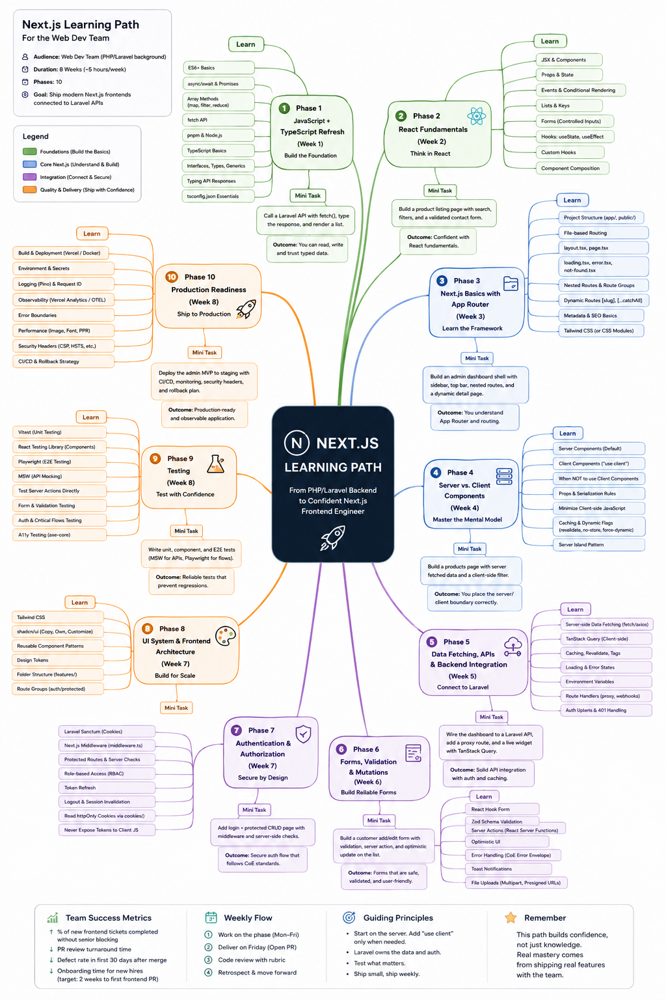

# Next.js Learning Path — Folder Index

This folder contains the team's Next.js learning resources. Start with the path document. Use the roadmap image as a visual reference. The gap analysis is reviewer-only and lives in its own file.

*Visual map of the Next.js learning path — the 10 phases, four foundations, three guiding principles, and the career outcomes we're targeting. Used as a visual completeness check against our [intermediate path](./intermediate.md), not as a curriculum.*

---

## 📂 What's in this folder

| File | Purpose | Read this when… |
|---|---|---|
| [**intermediate.md**](./intermediate.md) | The official team learning path — 10 phases over 8 weeks | You're starting the Next.js track, planning the pilot, or running a code review against the rubric |
| [**nextjs-learning-path.png**](./nextjs-learning-path.png) | Visual map of the 10 phases, four foundations, and guiding principles | You want a single-page visual overview of the path |
| [**nextjs-gap-analysis.md**](./nextjs-gap-analysis.md) | Reviewer-only: how our path maps to the full Next.js ecosystem | You're a tech lead reviewing scope, planning a revision, or auditing pilot feedback |

---

## 🚀 Where to start

1. **New to Next.js on the team?** Open [intermediate.md](./intermediate.md) and read the **Architecture call** at the top — it sets the "Next.js as a frontend for our Laravel API" frame for everything that follows.
2. **Planning a pilot batch?** Read the **Suggested 8-Week Plan** and the **Weekly PR Assessment Rubric** — those are the two operational artefacts the pilot will run on.
3. **Coming from the React path?** Read [intermediate.md](./intermediate.md) — the Next.js path is the **follow-on** to the [React Learning Path](../react/intermediate.md). Phase 2 (React Fundamentals) is a refresher; if your React is fresh, you can skim and move on.
4. **Reviewing the path's scope?** Open [nextjs-gap-analysis.md](./nextjs-gap-analysis.md). It maps the Next.js ecosystem to our path with a covered / partial / not-covered status, and lists what we deliberately skip. Not reader-facing.

---

## 🔗 Related paths in this repo

| Path | Audience | Length | Status |
|---|---|---|---|
| [React](../react/intermediate.md) | Backend engineers new to React — **prerequisite** | 6 weeks, 8 phases | v0.3 pilot |
| [**Next.js** (this folder)](./intermediate.md) | Engineers who finished the React path | 8 weeks, 10 phases | v0.6 pilot |

**Order of study:** React first → Next.js second. The Next.js path assumes the React fundamentals in the [React folder](../react/).

---

## 🤖 AI delegation guidance (CoE standard)

When working through the Next.js path with AI assistance:

- 🟢 **FULL DELEGATE:** scaffolding Vitest tests, generating Zod schemas from examples, formatting code, explaining a concept in your own words
- 🟡 **COLLABORATE:** writing Server Actions, designing the route group structure, choosing between Server and Client components
- 🟠 **HUMAN-LED:** designing the server/client boundary, picking the auth flow, code review
- 🔴 **NEVER DELEGATE:** auth code, session handling, anything touching tokens, security header config, production database work

For the full model, see [general/ai-era-coding-guidelines.md](../../../../general/ai-era-coding-guidelines.md).

---

## 📊 Document control

| Field | Value |
|---|---|
| Document | Next.js Learning Path — Folder Index |
| Version | 0.2 (next-pilot-review: paired with intermediate.md v0.6) |
| Owner | CoE Web Working Group |
| Review Cycle | Quarterly |
| Status | Draft — pilot batch |
| Related | [intermediate.md](./intermediate.md), [nextjs-learning-path.png](./nextjs-learning-path.png), [nextjs-gap-analysis.md](./nextjs-gap-analysis.md), [React Learning Path](../react/intermediate.md) |

---

**Maintained by:** Techversant CoE
**Last Updated:** June 2026
