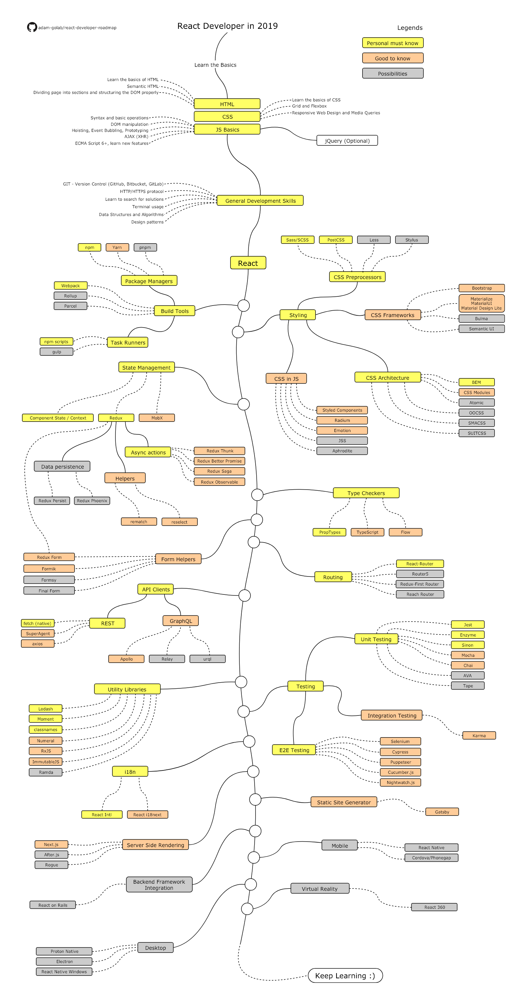

# React Learning Path Folder Index

This folder contains the team's React learning resources. Start with the path document. Use the roadmap image as a visual reference. The gap analysis is reviewer-only and lives in its own file.

*The community [React Developer Roadmap by adam-golab](https://github.com/adam-golab/react-developer-roadmap). The full React ecosystem at a glance used as a visual completeness check against our [intermediate path](./intermediate.md), not as a curriculum.*

---

## What's in this folder

| File | Purpose | Read this when |
|---|---|---|
| [**intermediate.md**](./intermediate.md) | The official team learning path 8 phases over 6 weeks | You're starting the React track, planning the pilot, or running a code review against the rubric |
| [**roadmap.png**](./roadmap.png) | The community [React Developer Roadmap by adam-golab](https://github.com/adam-golab/react-developer-roadmap) (15422949) | You want a visual map of the wider React ecosystem |
| [**roadmap-gap-analysis.md**](./roadmap-gap-analysis.md) | Reviewer-only: how our path maps to the full roadmap | You're a tech lead reviewing scope, planning a revision, or auditing pilot feedback |

---

## Where to start

1. **New to React on the team?** Open [intermediate.md](./intermediate.md) and read the **Architecture call** at the top it sets the "React as a UI library for our Laravel API" frame for everything that follows.
2. **Planning a pilot batch?** Read the **Suggested 6-Week Plan** and the **Weekly PR Assessment Rubric** those are the two operational artefacts the pilot will run on.
3. **Coming from the Next.js path?** Read [intermediate.md](./intermediate.md) the React path is the **prerequisite foundation** for the [Next.js Learning Path](../nextjs/intermediate.md).
4. **Reviewing the path's scope?** Open [roadmap-gap-analysis.md](./roadmap-gap-analysis.md). It maps every branch of the community React roadmap to our path with a covered / partial / not-covered status, and lists what we deliberately skip. Not reader-facing.

---

## Related paths in this repo

| Path | Audience | Length | Status |
|---|---|---|---|
| [**React** (this folder)](./intermediate.md) | Backend engineers new to React | 6 weeks, 8 phases | v0.3 pilot |
| [Next.js](../nextjs/intermediate.md) | Engineers who finished this path | 8 weeks, 10 phases | v0.5 pilot |

**Order of study:** React first Next.js second. The Next.js path assumes the React fundamentals in this document.

---

## AI delegation guidance (CoE standard)

When working through the React path with AI assistance:

- **FULL DELEGATE:** scaffolding Vitest tests, generating Zod schemas from examples, formatting code, explaining a concept in your own words
- **COLLABORATE:** writing components, designing the file structure, choosing between `useState` and `useReducer`
- **HUMAN-LED:** designing the component API, picking the state-management pattern, code review
- **NEVER DELEGATE:** auth code, session handling, anything touching tokens, production database work

For the full model, see [general/ai-era-coding-guidelines.md](../../../../../general/ai-era-coding-guidelines.md).

---

## Document control

| Field | Value |
|---|---|
| Document | React Learning Path Folder Index |
| Version | 0.3 (roadmap image embedded in README header) |
| Owner | CoE Web Working Group |
| Review Cycle | Quarterly |
| Status | Draft pilot batch |
| Related | [intermediate.md](./intermediate.md), [roadmap.png](./roadmap.png), [roadmap-gap-analysis.md](./roadmap-gap-analysis.md), [Next.js Learning Path](../nextjs/intermediate.md) |

---

**Maintained by:** Techversant CoE
**Last Updated:** June 2026
