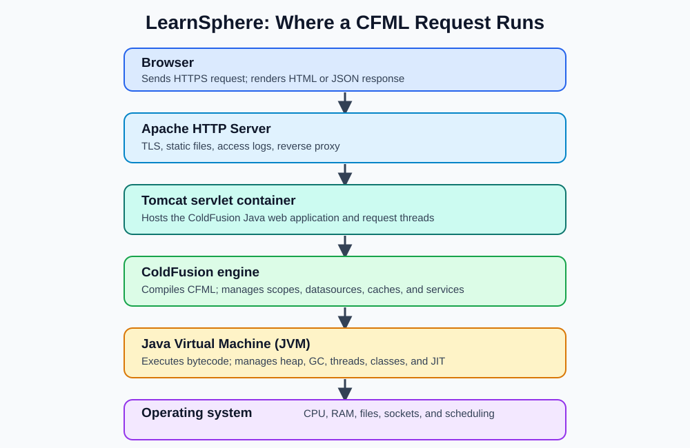
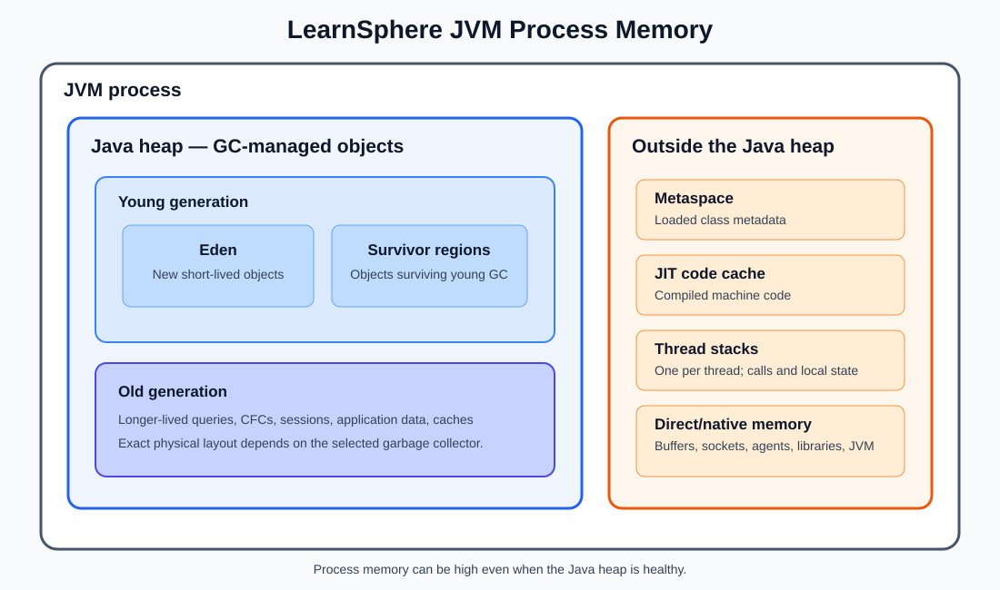
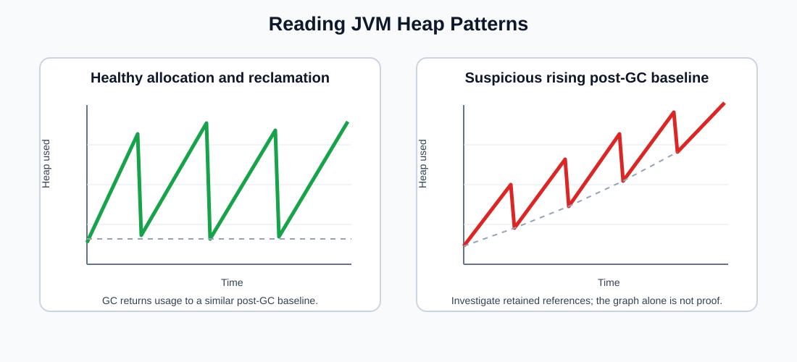
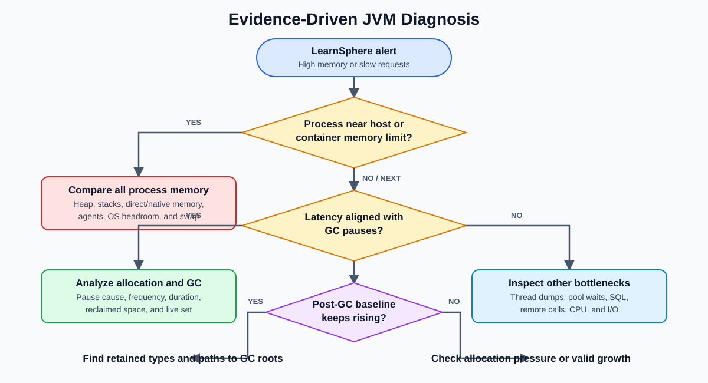
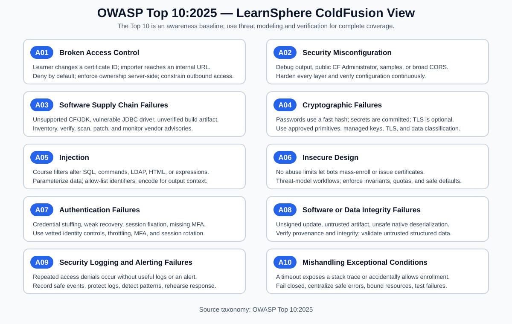
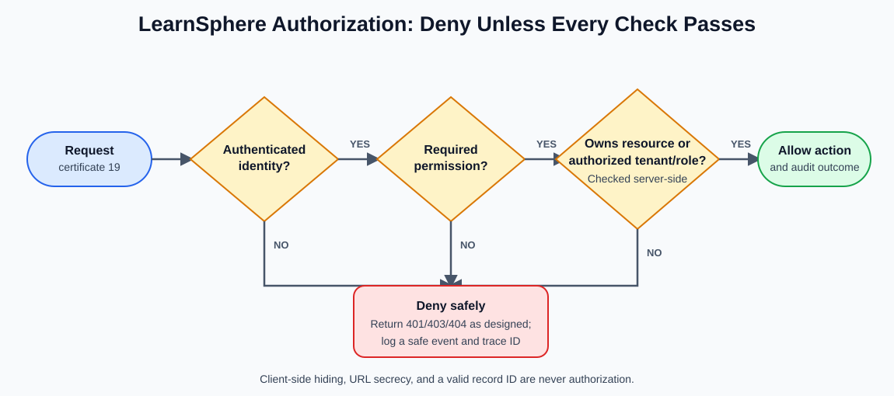

# ColdFusion Deep Expertise: Detailed Guide

> A practical companion to [Phase 1: ColdFusion Deep Expertise](./README.md), using one e-learning application to explain what each ColdFusion feature does, why it exists, and which problem it solves.

---

## How to use this guide

The examples use **LearnSphere**, a fictional e-learning application. A learner can browse courses, enroll, complete lessons, and download a certificate. Administrators can publish courses and view reports.

The simplified production architecture is:

```text
Browser or mobile app
        |
Load balancer / web server
        |
Two ColdFusion instances
        |---- shared cache or session store
        |
Relational database
```

The examples favor tag-based CFML to match the existing LearnSphere codebase and use these main records:

- `courses`: course details and publication status
- `enrollments`: the learner-to-course relationship
- `lesson_progress`: completed lessons and completion time
- `certificates`: generated certificate metadata

Adobe ColdFusion and Lucee differ in some Administrator labels, cache providers, monitoring features, and JVM configuration locations. Treat configuration names as concepts, then verify the exact option against the version running in the target environment.

## Contents

1. [Trace a CFML request from HTTP to response](#1-trace-a-cfml-request-from-http-to-response)
2. [Explain how ColdFusion interacts with the JVM](#2-explain-how-coldfusion-interacts-with-the-jvm)
3. [Configure and tune JVM settings for ColdFusion](#3-configure-and-tune-jvm-settings-for-coldfusion)
4. [Implement advanced caching strategies](#4-implement-advanced-caching-strategies)
5. [Secure ColdFusion applications against common vulnerabilities](#5-secure-coldfusion-applications-against-common-vulnerabilities)
6. [Optimize database interactions and connection pooling](#6-optimize-database-interactions-and-connection-pooling)
7. [Use built-in diagnostics and debugging tools](#7-use-built-in-diagnostics-and-debugging-tools)
8. [Configure session management for clustered environments](#8-configure-session-management-for-clustered-environments)
9. [Implement REST APIs with proper error handling](#9-implement-rest-apis-with-proper-error-handling)
10. [Use cfthread for parallel processing safely](#10-use-cfthread-for-parallel-processing-safely)

---

## 1. Trace a CFML request from HTTP to response

### Why this exists and the problem it solves

A page can be slow even when its visible CFML template is simple. Time may be spent at the load balancer, waiting for a ColdFusion request thread, running an application lifecycle hook, compiling a changed template, borrowing a database connection, executing SQL, or serializing JSON.

Tracing the complete lifecycle replaces “ColdFusion is slow” with a specific statement such as “the request waited 900 ms for a database connection.” That distinction tells the team what to fix.

### LearnSphere example

A learner requests `GET /courses/42.cfm`. The full journey is:

```text
1. Browser sends HTTP request
2. Load balancer selects a healthy LearnSphere node
3. IIS/Apache/Tomcat maps the URL to ColdFusion
4. A ColdFusion request thread accepts the work
5. ColdFusion locates the applicable Application.cfc
6. Application/session startup events run when required
7. onRequestStart() runs
8. The target template, or onRequest(), runs
9. CourseService loads course 42 from cache or database
10. The view encodes values and creates HTML
11. onRequestEnd() runs after successful request processing
12. Web server sends status, headers, and body to the browser
```

On the first request after a template changes, ColdFusion parses and compiles CFML into JVM-executable classes. Later requests normally reuse the compiled form until recompilation is needed. This explains why the first request can be slower than following requests.

### Important lifecycle events

| Event | When it happens | Suitable LearnSphere use | Avoid |
|---|---|---|---|
| `onApplicationStart()` | First application request or application restart | Build services and load small configuration | Loading an unbounded course catalog |
| `onSessionStart()` | A new session starts | Set a small anonymous preference structure | Querying every course for every visitor |
| `onRequestStart()` | Before each handled request | Create a trace ID, apply access rules | Slow reports or unrelated API calls |
| `onRequest()` | Wraps execution of a requested page when implemented | Central page dispatch or layout behavior | Assuming it behaves identically for every REST/CFC call |
| `onRequestEnd()` | At the end of normal request processing | Record total duration | Essential business work that must always run |
| `onError()` | An unhandled application error reaches the handler | Log a safe error with the trace ID | Displaying stack traces to learners |
| `onMissingTemplate()` | A requested template cannot be found | Return a friendly 404 page | Silently redirecting every bad URL |

Application lifecycle behavior can differ by request type and engine version. Test page, CFC, REST, task, and error paths instead of assuming one trace represents all traffic.

### Add a correlation trace

The trace ID follows one request through application and database logs. It is the software equivalent of a parcel tracking number.

```cfml
<cfcomponent>
  <cfset this.name = "LearnSphere">
  <cfset this.sessionManagement = true>
  <cfset this.sessionTimeout = createTimeSpan(0, 0, 30, 0)>

  <cffunction name="onRequestStart" access="public" returntype="boolean" output="false">
    <cfargument name="targetPage" type="string" required="true">

    <cfset request.traceId = createUUID()>
    <cfset request.startedAt = getTickCount()>

    <cfheader name="X-Trace-Id" value="#request.traceId#">
    <cflog
      file="learnsphere-request"
      type="information"
      text="request.start traceId=#request.traceId# path=#arguments.targetPage#">

    <cfreturn true>
  </cffunction>

  <cffunction name="onRequestEnd" access="public" returntype="void" output="false">
    <cfargument name="targetPage" type="string" required="true">
    <cfset var durationMs = getTickCount() - request.startedAt>

    <cflog
      file="learnsphere-request"
      type="information"
      text="request.end traceId=#request.traceId# durationMs=#durationMs#">
  </cffunction>
</cfcomponent>
```

Do not log passwords, session identifiers, authorization headers, or learner personal data.

### Includes and custom tags

`cfinclude` executes another template inside the current request. A custom tag has a start phase and, when it has an end tag, an end phase. Both add work to the same request and can hide the real source of latency if they are not named in diagnostics.

```text
course.cfm
  -> includes course-header.cfm
  -> invokes cf_courseCard
       -> start mode prepares the card
       -> body renders course information
       -> end mode closes the card
```

Prefer CFC methods for reusable business logic; use includes for focused view fragments. This makes execution paths easier to test and time.

### A repeatable tracing method

1. Capture the URL, method, status, trace ID, and total duration.
2. Separate queue time, CFML execution, database time, outbound calls, and rendering time.
3. Check whether the request triggered application/session startup or template compilation.
4. Follow the same trace ID through web, application, and database logs.
5. Repeat after warm-up so first-request compilation does not distort the baseline.
6. Compare a fast and a slow trace before changing configuration.

**You understand this topic when:** you can draw the path for an HTML, CFC, and REST request and identify where timing evidence is available at each stage.

---

## 2. Explain how ColdFusion interacts with the JVM

### Why this exists and the problem it solves

ColdFusion is not only a template interpreter. It runs on the Java Virtual Machine (JVM). CFML is translated into Java-compatible executable code, and the JVM supplies memory management, threads, class loading, garbage collection, networking, and access to Java libraries.

This matters because an `OutOfMemoryError`, blocked Java thread, driver conflict, or long garbage-collection pause appears to be a ColdFusion problem even when the controlling behavior is in the JVM.

### The layers in LearnSphere

```text
LearnSphere CFML: CourseService.cfc, course.cfm, REST resources
ColdFusion engine: CFML compiler, scopes, tags/functions, datasource manager
Java libraries: JDBC driver, cache client, PDF library
JVM: heap, garbage collector, threads, class loaders
Operating system: CPU, physical memory, files, sockets
```

### CFML compilation and execution

When `CourseService.cfc` changes, the engine parses it and creates JVM-loadable classes. The JVM verifies and executes those classes. Frequently executed methods may be optimized further by the JVM's just-in-time compiler.

The practical consequences are:

- Cold starts and recently changed templates may be slower.
- A large deployment can create many loaded classes and consume metaspace.
- Java stack traces often contain both ColdFusion engine frames and LearnSphere source locations.
- Java library and JDBC-driver versions must be compatible with the supported JVM and CF engine.

### Memory areas in plain language

| Area | Real-life analogy | LearnSphere content | Failure signal |
|---|---|---|---|
| Heap | Working tables in a library | Queries, structs, CFCs, sessions, cached courses | High GC time or `OutOfMemoryError: Java heap space` |
| Metaspace | Catalog of available book types | Loaded CFML/Java class definitions | `OutOfMemoryError: Metaspace` |
| Thread stack | One worker's private notepad | Method calls and local call state | Stack overflow or too much native memory from many threads |
| Native/direct memory | Equipment outside the reading room | Buffers, sockets, JVM internals | Process memory grows beyond visible heap |

A low heap graph does not prove the entire process has enough memory. The JVM, thread stacks, direct buffers, native libraries, and operating system all need space.

### Garbage collection

Garbage collection (GC) reclaims heap objects that can no longer be reached. If LearnSphere creates a large temporary query for every report request, the heap fills quickly and GC works more often. If `application.courseCache` retains every historical course forever, the objects remain reachable and GC cannot remove them.

GC solves automatic memory reclamation; it does not fix unbounded retention. First reduce unnecessary allocations and retained data, then tune the collector if measurements still justify it.

### Threads and contention

Each active HTTP request normally occupies a request-processing thread. A thread waiting 20 seconds for the database remains unavailable for other learners. `cfthread`, scheduled tasks, database drivers, and libraries may use additional threads.

This produces an important diagnostic rule:

> A large queue can mean too little capacity, but it can also mean existing threads are blocked on a slow dependency.

Increasing the request-thread limit without finding the dependency can overload the database faster.

### Java interoperability example

ColdFusion can call Java classes directly. Here LearnSphere generates a lowercase enrollment reference:

```cfml
<cffunction name="createEnrollmentReference" access="public" returntype="string" output="false">
  <cfset var uuid = createObject("java", "java.util.UUID").randomUUID()>
  <cfreturn lCase(uuid.toString())>
</cffunction>
```

Use Java interoperability when it solves a clear gap, pin compatible library versions, isolate the call behind a CFC, and convert Java exceptions into application-level errors. This prevents Java-specific details from spreading through the application.

### Reading a mixed stack trace

Read from the application failure outward:

1. Find the first frame that names a LearnSphere `.cfm` or `.cfc` source location.
2. Identify the exception type and deepest cause (`Caused by` in Java traces).
3. Decide whether the failure belongs to LearnSphere code, the CF engine, a driver/library, or infrastructure.
4. Match the timestamp and trace ID with request and database evidence.
5. Preserve the full trace internally, but return only a safe message and trace ID to the learner.

**You understand this topic when:** you can connect CFML scopes, request threads, compiled templates, JDBC calls, heap pressure, and garbage collection to their JVM counterparts.

---

## 3. Configure and tune JVM settings for ColdFusion

### Why this exists and the problem it solves

JVM tuning gives ColdFusion enough memory and suitable garbage-collection behavior for its measured workload. It is not a list of universal “fast” flags. A heap that is too small causes frequent collection or allocation failures; a heap that is unnecessarily large can hide memory retention, lengthen some diagnostic operations, and starve the operating system.

The goal for LearnSphere is stable latency during a class launch, when thousands of learners arrive within a few minutes.

### Understand the runtime before tuning it

In the LearnSphere deployment, a dynamic request passes through these layers:



Text version of the same request path:

```text
Browser
  -> Apache HTTP Server
  -> Tomcat servlet container
  -> ColdFusion engine
  -> JVM
  -> Operating system
```

Each layer solves a different problem:

| Layer | Responsibility in LearnSphere | Typical evidence |
|---|---|---|
| Apache HTTP Server | Terminates TLS, serves static files, and reverse-proxies CFML requests | Access/error logs, proxy timing, TLS errors |
| Tomcat | Hosts the Java web application and manages servlet request processing | Connector state, request threads, container logs |
| ColdFusion engine | Compiles and executes CFML, manages scopes, datasources, caches, and CF services | CF logs, request metrics, datasource statistics |
| JVM | Executes Java bytecode and manages heap, GC, threads, class loading, and JIT compilation | GC logs, JFR, thread/heap dumps, `jstat` |
| Operating system | Supplies CPU, physical/virtual memory, files, sockets, and process scheduling | CPU, resident memory, swap, disk, network metrics |

This is one common deployment model, not a universal rule. ColdFusion can use a bundled web server or another supported web-server/servlet arrangement. Confirm the real request path before assigning a symptom to Apache, Tomcat, ColdFusion, or the JVM.

### Understand JVM memory areas

Use this conceptual model when reading LearnSphere memory graphs:



Text version of the same memory model:

```text
JVM process memory
|
+-- Java heap
|   +-- Young generation
|   |   +-- Eden
|   |   +-- Survivor spaces
|   +-- Old generation
|
+-- Memory outside the Java heap
    +-- Metaspace
    +-- JIT code cache
    +-- One stack per thread
    +-- Direct buffers and other native memory
```

Exact region names and behavior depend on the selected garbage collector and JDK. For example, G1 physically divides the heap into regions and assigns them roles; the young/old model remains useful for reasoning but is not a literal fixed layout for every collector.

#### Heap

The heap contains most application objects, including:

- query results;
- structs and arrays;
- CFC instances;
- session and application data;
- cached course records;
- temporary JSON and report objects.

The JVM garbage collector manages heap reclamation. ColdFusion code controls which objects are created and which references remain reachable, so application design still determines whether GC can reclaim them.

#### Memory outside the heap

| Area | What it contains | LearnSphere concern |
|---|---|---|
| Metaspace | Loaded class metadata, including classes produced from compiled CFML | Repeated redeployment/class-loader retention can cause growth |
| Code cache | Machine code generated by the just-in-time compiler | Exhaustion can reduce JIT effectiveness; normally inspect only when evidence points here |
| Thread stacks | Method frames, local primitive values, and object references for each thread | Excessive thread counts consume native memory even when heap is healthy |
| Direct/native memory | Buffers, sockets, JVM structures, agents, and native libraries | Process memory can be high while the heap graph looks normal |

Thread stacks and direct buffers are often casually called “non-heap,” but they are not all represented by the JVM's formal non-heap memory-pool metrics. Compare JVM pool metrics with total process memory.

### Heap versus stack

| Heap | Thread stack |
|---|---|
| Stores most Java/CFML objects | Stores active method-call frames and local execution state |
| Shared by threads, subject to synchronization rules | One stack belongs to one thread |
| Reclaimed by GC when objects become unreachable | Frames are removed automatically as methods return |
| Usually the largest JVM memory area | Smaller per thread, but multiplied by thread count |

Conceptually, a local variable on a stack can hold a reference to a course struct on the heap. Removing that one stack frame does not guarantee reclamation: the same struct might still be referenced from `application`, `session`, a cache, or another live object.

### Understand garbage collection before changing it

The JVM performs garbage collection; neither ColdFusion nor Tomcat independently frees Java heap objects. The operating system supplies process memory but does not decide which Java objects are unreachable.

GC generally follows this reasoning:

1. LearnSphere allocates objects, such as a query and JSON response.
2. Live references are traced from roots such as active threads and static/shared state.
3. Objects with no reachable path become eligible for reclamation.
4. The collector reclaims or reorganizes memory according to its algorithm.

Traditional terminology describes:

- **Young/minor collection:** reclaims short-lived objects in the young generation; normally frequent and relatively short.
- **Old/major collection:** processes older objects; meaning varies across collectors and tools.
- **Full collection:** processes most or all heap regions and is normally more disruptive.
- **G1 mixed collection:** collects young regions plus selected old regions; it is not identical to a traditional full GC.

Do not diagnose only from a label such as “major GC.” Look at pause duration, frequency, cause, reclaimed memory, allocation rate, and the post-GC live set. Avoid calling `System.gc()` or forcing production full collections as a routine monitoring technique.

### Distinguish allocation pressure from retained memory

These conditions need different fixes:

| Condition | What happens | LearnSphere example | Appropriate direction |
|---|---|---|---|
| Allocation pressure | Many temporary objects are created and later reclaimed | A report repeatedly builds large intermediate arrays | Reduce allocations/stream or paginate data; then evaluate GC |
| Memory retention/leak | Objects remain reachable after they are no longer useful | An unbounded `application` cache keeps every learner dashboard | Remove references, bound lifecycle, and fix ownership |
| Legitimate live-set growth | More valid data is actively needed | More concurrent sessions during a scheduled class | Measure per-session cost and capacity; resize only if justified |

The assignment below is not automatically a leak:

```cfml
<cfset application.users[learnerId] = userData>
```

It becomes a retention problem when the application has no bounded eviction/removal policy and keeps entries after they are no longer required. The key question is not “was memory allocated?” but “who still holds the reference, and should they?”

### Start with evidence, not settings

Record a representative baseline before changing anything:

- JVM vendor and version supported by the installed CF engine
- container or host memory limit and physical memory
- heap used after GC, allocation rate, and GC pause duration
- request throughput, percentiles, active threads, and queue depth
- session count and average session size
- cache size and hit rate
- datasource wait time and active connections
- process resident memory, CPU, and swap activity

### Build a memory budget

For a host or container with 8 GB available, do not give all 8 GB to `-Xmx`. The operating system, JVM native memory, metaspace, thread stacks, ColdFusion internals, agents, and sidecars need headroom.

```text
Available memory
  = Java heap
  + metaspace and code cache
  + thread stacks and direct/native buffers
  + monitoring agents and ColdFusion native use
  + operating-system headroom
```

The correct heap size comes from observed live-set and peak allocation behavior within this budget, not from copying another server's number.

### Choose `-Xms` and `-Xmx` deliberately

`-Xms` is the initial heap commitment and `-Xmx` is the maximum heap. On a dedicated, consistently loaded server, equal values can remove heap-expansion behavior and make the available heap predictable:

```text
-Xms4g
-Xmx4g
```

That is a design choice, not a universal best practice. Committing the maximum immediately may be wasteful on a small shared host, elastic container, developer workstation, or workload with a low normal live set. A wide range such as the following allows growth but makes warm-up and memory commitment less predictable:

```text
-Xms512m
-Xmx8g
```

Choose between them using the deployment model and measurements:

| Question | Why it matters |
|---|---|
| Is the node dedicated and expected to run at steady load? | A fixed commitment may improve predictability |
| Is the JVM inside a hard container limit? | Heap plus native memory must remain below the limit |
| What is heap usage immediately after normal GC under peak load? | Establishes the live-set requirement |
| How quickly does allocation rise during course launch/report generation? | Shows burst headroom required |
| Does the host swap or approach physical-memory exhaustion? | More heap may make system latency worse |

Increasing `-Xmx` can provide legitimate burst headroom and reduce collection frequency when the heap is undersized. It cannot make reachable objects collectible, repair an unbounded cache, fix a slow query, or solve blocked request threads. It also increases RAM commitment and can make some full-heap operations and heap dumps larger.

### Common settings and their purpose

| Setting | What it controls | Problem it can address | Caution |
|---|---|---|---|
| `-Xms` | Initial heap size | Repeated heap expansion during warm-up | Need not equal `-Xmx`; validate against deployment model |
| `-Xmx` | Maximum heap size | Insufficient room for measured live data and bursts | Cannot exceed the process/container memory budget |
| `-XX:+UseG1GC` | G1 garbage collector on supported JVMs | Balanced pause and throughput behavior for many server workloads | Use only when supported by the CF/JDK combination |
| `-XX:MaxGCPauseMillis=N` | GC pause-time target | Guides G1's trade-offs | It is a target, not a guarantee |
| `-Xlog:gc...` or legacy GC log flags | GC evidence | Diagnoses pauses, allocation, and heap behavior | Syntax depends on Java version |
| `-XX:+HeapDumpOnOutOfMemoryError` | Heap dump on allocation failure | Root-cause memory retention | Dumps can contain sensitive data and consume disk space |
| `-XX:HeapDumpPath=...` | Controlled dump location | Prevents uncertainty about where a failure dump lands | Directory must exist, be secured, and have adequate disk |

Example only—the values must come from LearnSphere measurements and the syntax must match its supported JDK:

```text
-Xms2g
-Xmx4g
-XX:+UseG1GC
-XX:MaxGCPauseMillis=300
-XX:+HeapDumpOnOutOfMemoryError
-XX:HeapDumpPath=D:/secure-diagnostics
```

Never paste JVM flags from an unrelated Java version into production. An unsupported or misspelled flag can prevent ColdFusion from starting.

### Enable diagnostic evidence safely

For a supported modern JDK, a GC logging configuration may look like this:

```text
-Xlog:gc*:file=D:/secure-diagnostics/gc.log:time,uptime,level,tags:filecount=5,filesize=20M
```

Unified logging syntax was introduced in Java 9, but available decorators and behavior still vary by JDK. Older JDKs use different flags. Verify the ColdFusion-supported JDK and test startup before deployment.

Keep diagnostic destinations outside the public web root, restrict access, monitor free disk, and rotate logs. Heap dumps, recordings, and command output can contain query values, tokens, paths, and learner data.

### Select the right diagnostic tool

| Tool | Best use | Example command or view | Production caution |
|---|---|---|---|
| FusionReactor | ColdFusion-aware request, transaction, heap, GC, and thread correlation | Compare course-request time with GC activity | Confirm agent overhead and licensed features |
| VisualVM | Interactive heap, thread, and local development analysis | Observe live heap and capture a development thread dump | Remote attachment must be secured; avoid casual production use |
| JDK Flight Recorder (JFR) / Mission Control | Low-overhead JVM event analysis | Examine allocation, locks, GC pauses, and hot methods | Use supported JDK settings and protect recordings |
| `jstat` | Lightweight JVM counter sampling | `jstat -gcutil <pid> 1000` | Counter names/meaning vary; one sample is not a trend |
| GC logs | Historical collection timing and reclamation | Correlate pauses with p95/p99 latency | Configure rotation to protect disk |
| Thread dumps | Blocked/runnable thread evidence | Capture several snapshots seconds apart | Can contain application details |
| Heap dump/histogram | Retained-object and reference-path analysis | Find what retains course/session objects | Potential pause, high disk usage, and sensitive content |

Common `jstat` fields include young collection count/time (`YGC`, `YGCT`) and full collection count/time (`FGC`, `FGCT`), although output depends on the JDK and selected option. Counts without elapsed time and workload context can mislead: ten collections over ten minutes differ from ten collections in one second.

### Read heap graphs correctly



A normal allocation/reclamation cycle often resembles a saw tooth:

```text
Heap used

      /|      /|       /|
     / |     / |      / |
____/  |____/  |_____/  |____ time
        GC      GC       GC
```

The heap rises as LearnSphere allocates objects, then falls when GC reclaims unreachable ones. The important baseline is how low it returns after comparable collections and workloads.

A suspicious trend looks different:

```text
Heap used

          /|          /|
      /| / |      /| / |
  /| / |/  |  /| / |/  |
_/ |/      |_/ |/      |______ time
   higher post-GC baseline each cycle
```

This suggests retention but does not prove a leak. A growing cache, more legitimate sessions, deployment warm-up, or changed workload can also raise the live set. Confirm with a heap histogram/dump and retained-reference analysis.

### Symptom-to-investigation map

| Symptom | Investigate first | Do not assume |
|---|---|---|
| Heap returns to a stable level after GC, but pauses are high | Allocation bursts, GC logs, large reports | “It is a memory leak” |
| Heap baseline rises after every class launch | Retained sessions/caches, heap histogram | “Add more heap” |
| CPU is low and requests queue | Thread dumps, DB/pool waits, remote calls | “Add more CPU” |
| Process memory is high but heap is moderate | Threads, direct/native memory, agents | “The heap graph is wrong” |
| Metaspace grows after repeated deployments | Class loading and redeployment behavior | “Course objects fill metaspace” |

### Investigate common LearnSphere retention sources

| Source | Why memory remains reachable | Better lifecycle |
|---|---|---|
| Large `application` objects | Application scope normally lives until application shutdown/restart | Store only shared essentials; bound and expire cached data |
| Huge session objects | Every active session holds its own copy/reference graph | Keep learner ID and small preferences; load authoritative data as needed |
| Unlimited caches | New keys are added without maximum size or eviction | Use TTL plus size/entry bounds and monitor eviction/hit rate |
| Expired logical users kept in a custom registry | Application code never removes the registry entry | Remove on lifecycle event and use defensive expiry/cleanup |
| Global query objects | Large results remain in a long-lived scope | Cache only justified projections for a measured TTL |
| Entire files read into memory | A large video/export becomes one or more large objects | Stream, paginate, or use bounded chunks where supported |
| Long-running `cfthread` work | Thread attributes/results and referenced graphs live until work/result lifecycle ends | Bound concurrency/duration and clear completed job state |
| Java resources not closed | Streams, responses, or handles retain native and Java state | Use the library's close pattern in `finally` or try-with-resources wrapper |
| ORM session growth | Loaded entities remain associated with a long unit of work | Bound units of work; flush/clear according to ORM transaction design |
| Repeated redeployment/class-loader retention | Old class loaders remain referenced | Inspect class-loader paths; fix retained framework/driver/thread references |

Do not “fix” these by scheduling restarts. A restart clears process state and may temporarily restore service, but it also destroys the evidence and leaves the lifecycle defect in place.

### Use a diagnostic decision path



Text version of the same decision path:

```text
Memory or latency alert
        |
        +-- Is total process memory near the host/container limit?
        |      +-- Yes: compare heap with native/thread/direct memory
        |
        +-- Is request latency aligned with GC pauses?
        |      +-- Yes: inspect pause cause, allocation rate, and reclaimed space
        |      +-- No: inspect thread dumps, datasource waits, and remote calls
        |
        +-- Does the post-GC heap baseline keep rising under comparable load?
               +-- Yes: identify retained object types and paths to GC roots
               +-- No: investigate allocation pressure or legitimate capacity growth
```

Do not force a full GC merely to answer the first question on a busy production node. Use naturally occurring post-GC measurements or an approved controlled diagnostic procedure.

### Ask consultant-level questions

| Observation or request | First questions to ask |
|---|---|
| “Memory keeps increasing” | Which metric—heap, committed heap, or resident process memory? Does the post-GC live set rise under comparable load? |
| “The application is slow” | Is latency correlated with GC, runnable CPU contention, blocked threads, datasource wait, SQL, or remote I/O? |
| “Restarting fixes it” | Which state did restart clear? Do heap, thread, pool, or cache trends identify the accumulating resource? |
| “Increase `-Xmx`” | What live-set/burst evidence shows the current heap is undersized, and where will native/OS headroom come from? |
| “How many request threads?” | What can CPU, datasource pools, and downstream services sustain, and where are current threads waiting? |
| “Is it a memory leak?” | Which object type grows, who retains it, and should that reference still exist? |

The developer mindset is to ask:

- Does memory fall after normal GC activity?
- Who owns the remaining references?
- Is this retention, normal live data, or temporary allocation pressure?
- Is GC consuming too much request time?
- Is heap sized within the complete process/host budget?
- Is the bottleneck in CFML, Tomcat, the JVM, the database, a remote service, or application design?

### Safe tuning cycle

1. Form one measurable hypothesis, such as “GC pauses cause the p99 latency spike.”
2. Capture a baseline under the same LearnSphere load profile.
3. Change one related setting in a non-production environment.
4. Run warm-up and representative load, including course browse and report generation.
5. Compare response percentiles, throughput, GC, memory, errors, and dependency health.
6. Verify the JVM starts cleanly and the diagnostic paths have enough secured disk.
7. Roll out one node at a time with a tested rollback.
8. Observe through at least one representative peak period.
9. Document the setting, evidence, owner, date, and result.

ColdFusion must be restarted for JVM argument changes. Use the engine's supported configuration mechanism and retain a recoverable copy of the previous arguments.

### Key takeaways

- ColdFusion executes through a Java servlet/runtime stack; identify the real deployment layers before tuning.
- Most application objects live on the heap; active calls and local execution state use one stack per thread.
- The JVM performs GC, while CFML lifecycle choices determine which objects remain reachable.
- High memory use alone is not a leak; a rising post-GC live set plus retained-reference evidence is more meaningful.
- Equal `-Xms`/`-Xmx` values can improve predictability in the right environment, but must fit the full memory budget.
- Increasing `-Xmx` is the result of capacity evidence, not the first troubleshooting action.
- Correlate GC logs, heap evidence, thread dumps, request monitoring, datasource metrics, and operating-system data before changing settings.

**You understand this topic when:** you can distinguish heap from process memory, allocation pressure from retention, and GC pauses from blocked threads—and can defend a JVM change with before/after evidence and operational trade-offs.

---

## 4. Implement advanced caching strategies

### Why this exists and the problem it solves

Caching stores a reusable result closer to the caller so LearnSphere does not repeatedly perform the same expensive work. It improves latency and protects the database, but introduces staleness, invalidation, memory, security, and clustering problems.

A cache is useful when data is read often, expensive to produce, and allowed to be temporarily stale. A learner's completed-payment state is a poor candidate for long caching; the public course-category list is a strong candidate.

### Choose the correct layer

| Layer | LearnSphere example | Main benefit | Main risk |
|---|---|---|---|
| Browser/CDN | Course thumbnails and public catalog pages | Work never reaches CF | Accidentally caching personalized content |
| ColdFusion object cache | Course details by ID | Avoid repeated service/DB work | Per-node inconsistency in a cluster |
| Query cache | Stable category query | Simple repeated-query reuse | Broad or unclear invalidation |
| Application scope | Small immutable configuration | Very fast local access | Manual synchronization and no automatic bounds |
| Distributed cache | Course catalog shared by both nodes | Cross-node consistency | Network dependency and serialization cost |
| Database/materialized result | Aggregated completion report | Reuse close to source | Refresh complexity |

### Cache-aside pattern

The service checks the cache, loads on a miss, then stores a value with a finite lifetime:

```cfml
<cffunction name="getPublishedCourse" access="public" returntype="struct" output="false">
  <cfargument name="courseId" type="numeric" required="true">

  <cfset var cacheKey = "course:v2:#arguments.courseId#">
  <cfset var qCourse = queryNew("")>
  <cfset var course = {}>

  <cfif cacheIdExists(cacheKey)>
    <cfreturn duplicate(cacheGet(cacheKey))>
  </cfif>

  <cfquery name="qCourse" datasource="learnSphereDSN" timeout="5">
    SELECT id, title, summary, updated_at
    FROM courses
    WHERE id = <cfqueryparam value="#arguments.courseId#" cfsqltype="cf_sql_integer">
      AND is_published = <cfqueryparam value="1" cfsqltype="cf_sql_bit">
  </cfquery>

  <cfif qCourse.recordCount EQ 0>
    <cfthrow type="Course.NotFound" message="Course not found">
  </cfif>

  <cfset course = {
    id = qCourse.id[1],
    title = qCourse.title[1],
    summary = qCourse.summary[1],
    updatedAt = qCourse.updated_at[1]
  }>

  <cfset cachePut(cacheKey, course, createTimeSpan(0, 0, 10, 0))>
  <cfreturn duplicate(course)>
</cffunction>
```

`duplicate()` protects the cached struct from accidental caller mutation. Confirm the engine/cache provider's support and semantics for object duplication, idle time, replication, and eviction.

### Design cache keys deliberately

A good key includes every input that changes the answer:

```text
course:v2:42
catalog:v3:locale=en-IN:category=cfml:page=1
learner-dashboard:v1:tenant=acme:learner=834
```

The version allows a safe format change. Tenant, learner, locale, role, filters, and page belong in the key whenever they affect the result. Omitting them can expose one user's or customer's data to another.

### Invalidation after a write

When an administrator publishes an updated course:

1. Commit the database transaction.
2. Remove `course:v2:42`.
3. Remove or version the affected catalog keys.
4. Publish an invalidation message if each CF node has a local cache.

Never invalidate before the transaction commits; another request could refill the cache with the old database value.

### Prevent a cache stampede

At 09:00, a popular course cache entry expires and 500 requests arrive. Without coordination, all 500 query the database. A short, key-specific lock lets one request refill while the others wait briefly:

```cfml
<cffunction name="getCourseWithProtectedRefill" access="public" returntype="struct" output="false">
  <cfargument name="courseId" type="numeric" required="true">

  <cfset var cacheKey = "course:v2:#arguments.courseId#">
  <cfset var course = {}>

  <cfif cacheIdExists(cacheKey)>
    <cfreturn duplicate(cacheGet(cacheKey))>
  </cfif>

  <cflock name="cache-refill:#cacheKey#" type="exclusive" timeout="3">
    <!--- Check again because another request may have filled it while this one waited. --->
    <cfif cacheIdExists(cacheKey)>
      <cfset course = cacheGet(cacheKey)>
    <cfelse>
      <cfset course = loadPublishedCourseFromDatabase(arguments.courseId)>
      <cfset cachePut(cacheKey, course, createTimeSpan(0, 0, 10, 0))>
    </cfif>
  </cflock>

  <cfreturn duplicate(course)>
</cffunction>
```

For a distributed cache, a local `lock` coordinates only one CF instance. Use a provider-supported distributed locking or single-flight approach when cross-node stampedes matter.

### Advanced policies

- **TTL with jitter:** vary expiration slightly so thousands of keys do not expire together.
- **Stale while revalidate:** briefly serve an older public catalog while one worker refreshes it.
- **Negative caching:** cache “course not found” for a very short period to absorb repeated invalid IDs; never let it hide a newly created record for too long.
- **Bounded caches:** set entry or memory limits and an eviction policy. TTL alone does not prevent a burst of unique keys.
- **Warm only proven hot data:** warming every course shifts a latency problem into startup and wastes memory.

Track hit ratio, miss load time, eviction count, entry count/size, stale-data incidents, and database work avoided. A 99% hit rate is not valuable if the remaining cached answer is wrong or exposes data.

**You understand this topic when:** you can explain freshness, key design, bounds, invalidation, stampede prevention, and node consistency for each cached LearnSphere value.

---

## 5. Secure ColdFusion applications against common vulnerabilities

### Why this exists and the problem it solves

Every HTTP value is untrusted: URL variables, forms, JSON, cookies, headers, filenames, and responses from partner systems. Security controls preserve confidentiality, integrity, and availability when data crosses a trust boundary.

Security is layered. Input validation does not replace SQL parameters; SQL parameters do not replace authorization; output encoding does not replace a Content Security Policy.

### Authenticity and taxonomy note

The supplied notes use the **OWASP Top 10:2021** names and order. That list is authentic, but it is no longer the newest edition. This guide uses the **OWASP Top 10:2025** taxonomy and carries the useful 2021 material into its current category.

| Supplied 2021 category | Location in OWASP 2025 |
|---|---|
| A01 Broken Access Control | A01 Broken Access Control |
| A02 Cryptographic Failures | A04 Cryptographic Failures |
| A03 Injection | A05 Injection |
| A04 Insecure Design | A06 Insecure Design |
| A05 Security Misconfiguration | A02 Security Misconfiguration |
| A06 Vulnerable and Outdated Components | A03 Software Supply Chain Failures, with broader scope |
| A07 Identification and Authentication Failures | A07 Authentication Failures |
| A08 Software and Data Integrity Failures | A08 Software or Data Integrity Failures |
| A09 Security Logging and Monitoring Failures | A09 Security Logging and Alerting Failures |
| A10 Server-Side Request Forgery (SSRF) | Included in A01 Broken Access Control |
| No direct 2021 equivalent | A10 Mishandling of Exceptional Conditions |

The Top 10 is an awareness and prioritization aid, not a complete security standard. Use a threat model and an appropriate verification standard for requirements and test coverage.



### A01:2025 — Broken Access Control

#### What it is and why the control exists

Authentication establishes identity. Authorization decides whether that identity may perform this operation on this resource, in this tenant, at this time. Broken access control lets a user operate outside those boundaries.

- **Horizontal escalation:** learner 834 changes `/certificates/18` to `/certificates/19` and sees another learner's certificate.
- **Vertical escalation:** an instructor calls an administrator-only course-publishing endpoint.
- **Forced browsing:** a hidden admin link is requested directly.
- **Missing method protection:** `GET` is protected but `PUT` or `DELETE` is not.
- **Cross-tenant access:** an administrator for customer A reads customer B's course data.



Authorization must run in trusted server-side code. Hiding a button, using an unpredictable ID, or accepting an ID that exists does not authorize access.

#### Tag-based ownership and permission example

The query constrains the certificate by ID, tenant, and learner ownership unless a trusted authorization service grants the broader permission. The service and policies require human security review.

```cfml
<cffunction name="getAuthorizedCertificate" access="public" returntype="query" output="false">
  <cfargument name="actor" type="struct" required="true">
  <cfargument name="certificateId" type="numeric" required="true">

  <cfset var canReadAny = false>
  <cfset var qCertificate = queryNew("")>

  <cfif NOT structKeyExists(arguments.actor, "isAuthenticated")
      OR NOT arguments.actor.isAuthenticated>
    <cfthrow type="Security.Unauthorized" message="Authentication required">
  </cfif>

  <cfif NOT structKeyExists(arguments.actor, "tenantId")
      OR NOT structKeyExists(arguments.actor, "userId")>
    <cfthrow type="Security.InvalidIdentity" message="Authenticated identity is incomplete">
  </cfif>

  <cfset canReadAny = application.authorizationService.hasPermission(
    arguments.actor,
    "certificate:read:any"
  )>

  <cfquery name="qCertificate" datasource="learnSphereDSN" timeout="5">
    SELECT id, learner_id, course_id, issued_at
    FROM certificates
    WHERE id = <cfqueryparam value="#arguments.certificateId#" cfsqltype="cf_sql_integer">
      AND tenant_id = <cfqueryparam value="#arguments.actor.tenantId#" cfsqltype="cf_sql_integer">
      <cfif NOT canReadAny>
        AND learner_id = <cfqueryparam value="#arguments.actor.userId#" cfsqltype="cf_sql_integer">
      </cfif>
  </cfquery>

  <cfif qCertificate.recordCount EQ 0>
    <!--- A 404 can avoid confirming whether an inaccessible record exists. --->
    <cfthrow type="Certificate.NotFound" message="Certificate not found">
  </cfif>

  <cfreturn qCertificate>
</cffunction>
```

Test every protected operation using at least: anonymous user, correct learner, different learner, authorized instructor, unauthorized instructor, tenant administrator, other-tenant administrator, and expired/disabled identity.

#### CSRF and SSRF within access-control boundaries

- Protect cookie-authenticated state changes with a framework/engine-supported synchronizer token or equivalent reviewed control. `SameSite` cookies add protection but do not replace a CSRF token where one is required.
- Do not use `GET` for enrollment, progress updates, password changes, or publication.
- For server-side URL fetching, prefer a fixed internal mapping such as `providerCode -> configured endpoint`; do not accept an arbitrary URL.
- Restrict scheme, port, destination, redirects, DNS behavior, response size, and timeout. Enforce outbound network rules so application validation is not the only barrier.
- Do not rely on a regular-expression denylist of private IPv4 ranges. It misses IPv6, alternate address forms, DNS rebinding, redirects, and parser differences.

```cfml
<!--- The learner supplies a provider code, never a destination URL. --->
<cfset allowedProviders = {
  "trusted-catalog" = application.settings.catalogProviders.trustedCatalog
}>
<cfset providerCode = lCase(trim(form.providerCode))>

<cfif NOT structKeyExists(allowedProviders, providerCode)>
  <cfthrow type="Security.InvalidDestination" message="Import provider is not allowed">
</cfif>

<cfhttp
  url="#allowedProviders[providerCode].baseUrl#/courses/#encodeForURL(form.courseCode)#"
  method="get"
  timeout="3"
  redirect="false"
  result="importResponse">
```

The configured `baseUrl` must come from reviewed deployment configuration, not user input, and egress controls should permit only the required destination.

### A02:2025 — Security Misconfiguration

#### What it is and why the control exists

Secure code can still be compromised by an exposed ColdFusion Administrator, production debug output, sample applications, broad file permissions, default accounts, unsafe CORS, excessive services, verbose errors, or inconsistent nodes.

Apply a repeatable hardening baseline across Apache/IIS, Tomcat, ColdFusion or Lucee, the JDK, operating system, database, load balancer, containers, and cloud services.

#### ColdFusion configuration checklist

- [ ] Restrict the Administrator and management endpoints to an administrative network; never expose them to the public internet.
- [ ] Remove samples, documentation applications, unused mappings, unused datasources, unused packages, and unnecessary services.
- [ ] Disable request-debug output in production and restrict any temporary diagnostics by environment and source.
- [ ] Use safe centralized error responses; do not expose stack traces, source paths, SQL, or engine versions.
- [ ] Disable directory listing and keep source-control metadata, backups, logs, dumps, uploads, and secrets outside the web root.
- [ ] Use least-privilege OS service accounts, datasource accounts, directories, and network rules.
- [ ] Configure CORS with exact trusted origins, required methods, and required headers; never combine a wildcard origin with credentialed requests.
- [ ] Send reviewed security headers at the web server/application layer, including HSTS only after HTTPS readiness is confirmed.
- [ ] Compare configuration across cluster nodes and detect drift.
- [ ] Follow the vendor lockdown guidance for the installed, supported ColdFusion version.

Do not copy unverified `Application.cfc` properties such as `this.blockCFAdmin`, `this.errorTemplate`, or `this.stackTrace`. They are not portable substitutes for web-server restriction, Administrator hardening, production debug configuration, and `onError()` handling.

### A03:2025 — Software Supply Chain Failures

#### What it is and why the control exists

LearnSphere depends on more than its CFML repository: ColdFusion/Lucee, Java, Tomcat, Apache/IIS modules, JDBC drivers, CF libraries, Java JARs, JavaScript packages, container images, build actions, artifact repositories, and deployment credentials. Compromise or obsolescence anywhere in that chain can compromise the application.

#### Required practices

- Maintain an inventory/SBOM containing direct and transitive components, versions, source, owner, and support status.
- Run supported ColdFusion, JDK, servlet container, web server, database driver, and operating-system combinations.
- Monitor Adobe/Lucee and dependency security advisories; test and deploy security fixes through an emergency patch path.
- Download updates from official repositories, verify signatures or published hashes where available, and retain provenance.
- Pin build dependencies and review lockfile changes; do not execute untrusted install/build scripts.
- Protect CI/CD identities, require review for pipeline changes, separate build from deploy authority, and sign or attest release artifacts where supported.
- Scan source, dependencies, containers, and deployed assets, but do not treat a scanner's clean result as proof of safety.
- Remove abandoned libraries rather than carrying them indefinitely.

Do not put a fixed statement such as “ColdFusion 2025 Update 11+” in a long-lived standard. Update numbers change. Link to the vendor's current security bulletin page and record the approved version in an actively maintained platform baseline.

### A04:2025 — Cryptographic Failures

#### What it is and why the control exists

Cryptography protects data when disclosure or unauthorized modification would harm learners or the business. Failures include plaintext transport/storage, obsolete algorithms, hardcoded keys, reused nonces/IVs, weak randomness, missing certificate validation, poor rotation, and encrypting passwords instead of hashing them.

#### Data-first decisions

1. Classify LearnSphere data and minimize collection/retention.
2. Decide whether confidentiality, integrity, authenticity, or all three are required.
3. Prefer platform/database/cloud encryption managed by a security owner over application cryptography when it meets the threat model.
4. Use an approved authenticated-encryption construction with a fresh nonce/IV and managed keys when field-level encryption is required.
5. Store keys in a secrets/KMS/HSM facility with access control, rotation, auditing, backup, and recovery—not in CFML, source control, logs, or ordinary application configuration.

Passwords must use a reviewed adaptive password-hashing implementation. Current OWASP guidance prefers Argon2id where available and treats bcrypt mainly as a legacy fallback. Work factors must be benchmarked and periodically reviewed; a universal “bcrypt cost 12+” rule is not technically durable. Never store passwords with reversible `encrypt()` or a fast hash such as SHA-256 alone.

The attachment's `encrypt(ssn, secretKey, "AES", "Base64")` example is incomplete and should not be copied. “AES” alone does not specify a safe mode, authentication, nonce/IV lifecycle, key derivation, rotation, or storage. Encryption and key management are red-zone work requiring human security ownership.

### A05:2025 — Injection

#### What it is and why the control exists

Injection occurs when untrusted data is interpreted as instructions. In ColdFusion this includes SQL/HQL, LDAP filters, operating-system commands, dynamic expressions, HTML/JavaScript, email headers, and unsafe template/file paths.

#### Validate data, parameterize values, allow-list structure

```cfml
<cfset allowedSorts = {
  "title" = "title ASC",
  "newest" = "published_at DESC",
  "difficulty" = "difficulty ASC"
}>
<cfparam name="url.sort" type="string" default="title">
<cfset sortKey = lCase(trim(url.sort))>

<cfif NOT structKeyExists(allowedSorts, sortKey)>
  <cfset sortKey = "title">
</cfif>

<cfquery name="qCourses" datasource="learnSphereDSN" timeout="5">
  SELECT id, title, difficulty, published_at
  FROM courses
  WHERE is_published = <cfqueryparam value="1" cfsqltype="cf_sql_bit">
    AND category_id = <cfqueryparam value="#url.categoryId#" cfsqltype="cf_sql_integer">
  ORDER BY #allowedSorts[sortKey]#
</cfquery>
```

The dynamic `ORDER BY` is safe only because the final SQL fragment comes from a fixed internal map. `cfqueryparam` handles data values; it cannot parameterize a table, column, direction, or SQL keyword.

Additional controls:

- Never send user-controlled strings to `cfexecute`; use a fixed command and tightly reviewed arguments only when the feature is unavoidable.
- Avoid `evaluate()` and dynamic CFML execution with untrusted values.
- Parameterize ORM/HQL values using the engine/framework's supported parameter mechanism.
- Validate type, length, range, cardinality, and business rules before expensive processing.
- Encode output for its exact context. HTML, HTML attribute, JavaScript, CSS, and URL contexts are not interchangeable.

```cfml
<h1><cfoutput>#encodeForHTML(qCourse.title)#</cfoutput></h1>
<a href="/catalog.cfm?q=<cfoutput>#encodeForURL(url.q)#</cfoutput>">Search again</a>
```

### A06:2025 — Insecure Design

#### What it is and why the control exists

Some vulnerabilities cannot be patched with input validation because the workflow itself is unsafe. Examples include unlimited certificate generation, no approval for course publication, a recovery process that support staff can bypass, or enrollment limits enforced only in the browser.

For each new LearnSphere feature:

- identify assets, actors, trust boundaries, abuse cases, and failure states;
- define invariants such as “only an enrolled learner who completed every required lesson can receive a certificate”;
- deny by default and require explicit capability grants;
- enforce rate, quantity, state-transition, and tenant limits in the domain/service layer;
- separate high-risk duties and require approval where appropriate;
- design for dependency timeout, retry, duplicate request, race condition, and partial failure;
- write negative tests directly from the threat model.

```cfml
<!--- Start denied; only the reviewed policy service can grant the action. --->
<cfset hasAccess = false>

<cfif structKeyExists(request, "actor") AND request.actor.isAuthenticated>
  <cfset hasAccess = application.authorizationService.hasPermission(
    request.actor,
    "course:publish"
  )>
</cfif>

<cfif NOT hasAccess>
  <cfthrow type="Security.Forbidden" message="Access denied">
</cfif>
```

### A07:2025 — Authentication Failures

#### What it is and why the control exists

Authentication failures let an attacker impersonate a learner or administrator through credential stuffing, weak recovery, unsafe MFA fallback, session fixation, insecure cookies, user enumeration, or long-lived credentials.

- Prefer a vetted identity provider or centrally maintained authentication service over custom authentication code.
- Support long passwords/passphrases and screen against compromised/common passwords; avoid arbitrary composition rules that encourage predictable patterns.
- Use MFA for administrative and other sensitive accounts, with a reviewed recovery process.
- Throttle credential, MFA, reset, and recovery attempts using identity plus risk signals; avoid a simple IP-only permanent lockout.
- Return consistent messages and broadly similar behavior so login/recovery does not reveal whether an account exists.
- Rotate the session identifier after authentication and privilege changes using the function supported by the deployed engine.
- Set `Secure`, `HttpOnly`, and an appropriate `SameSite` cookie policy; define idle and absolute expiry.
- Invalidate server-side sessions during logout, password reset, account disablement, and relevant security events.
- Do not put credentials, tokens, or session identifiers in URLs or logs.

```cfml
<!--- Identity verification remains inside a human-reviewed authentication service. --->
<cfset authResult = application.identityService.authenticate(
  username = form.username,
  password = form.password
)>

<cfif authResult.isAuthenticated>
  <!--- Confirm sessionRotate() support and behavior on the deployed engine. --->
  <cfset sessionRotate()>
  <cfset session.user = {
    userId = authResult.userId,
    tenantId = authResult.tenantId
  }>
<cfelse>
  <cfthrow type="Security.AuthenticationFailed" message="Authentication failed">
</cfif>
```

Authentication, authorization, cryptography/key management, PII, and payment handling are red-zone work in this repository. The examples explain boundaries; they do not authorize production implementation without human security review.

### A08:2025 — Software or Data Integrity Failures

#### What it is and why the control exists

Integrity controls establish that code, configuration, updates, serialized objects, and important business events came from an expected source and were not altered without detection.

- Verify build/update provenance and integrity before installation.
- Protect branches, CI workflows, artifact repositories, package registries, and deployment approvals.
- Do not trust client-supplied fields such as `isCompleted`, `price`, `role`, or `certificateIssued`; calculate authoritative state server-side.
- Validate webhook signatures, freshness, replay protection, and expected event state before applying changes.
- Apply vendor-supported Java deserialization filters where ColdFusion features or libraries use native Java serialization.
- Do not deserialize native objects from an untrusted source.

`deserializeJSON()` parses JSON data; it is not equivalent to native Java object deserialization and is not automatically an A08 vulnerability. The real risks are unbounded input, parser behavior, and trusting the resulting shape or fields. Parse once, limit request size/depth where supported, then validate the result before use:

```cfml
<cftry>
  <cfset enrollmentInput = deserializeJSON(requestBody)>

  <cfif NOT isStruct(enrollmentInput)
      OR NOT structKeyExists(enrollmentInput, "courseId")
      OR NOT isValid("integer", enrollmentInput.courseId)>
    <cfthrow type="Validation.InvalidBody" message="A valid courseId is required">
  </cfif>

  <cfcatch type="JSONParserException">
    <cfthrow type="Validation.InvalidJson" message="Request body is not valid JSON">
  </cfcatch>
</cftry>
```

Exception types vary by engine/version; test the deployed implementation and map its parser failure to the application's stable validation error.

### A09:2025 — Security Logging and Alerting Failures

#### What it is and why the control exists

Prevention will sometimes fail. Security logs and alerts make suspicious behavior visible soon enough to investigate and contain it. A log line without monitoring, ownership, retention, time synchronization, or response is not detection.

Record authentication outcomes, authorization denials, sensitive administrator actions, validation/rate-limit failures, session lifecycle events, security configuration changes, and integrity verification failures.

```cfml
<cffunction name="logSecurityEvent" access="private" returntype="void" output="false">
  <cfargument name="eventCode" type="string" required="true">
  <cfargument name="outcome" type="string" required="true">
  <cfargument name="actorId" type="string" required="false" default="anonymous">

  <!--- eventCode and outcome must be internal constants, not raw user input. --->
  <cfset var logLine = "event=#arguments.eventCode# outcome=#arguments.outcome#">
  <cfset logLine = logLine & " actorId=#arguments.actorId# traceId=#request.traceId#">
  <cflog
    file="learnsphere-security"
    type="warning"
    text="#logLine#">
</cffunction>
```

- Do not log passwords, access/refresh tokens, session cookies, encryption keys, payment data, full sensitive request bodies, or unnecessary learner PII.
- Derive source IP only through a trusted proxy configuration; arbitrary forwarded headers are attacker-controlled.
- Protect logs from modification and unauthorized access, synchronize clocks, define retention, and test restoration/search.
- Alert on patterns such as repeated cross-tenant denials, administrator login anomalies, unusual certificate issuance, or security controls being disabled.
- Include a trace ID, event code, outcome, actor/resource identifiers appropriate to policy, node, and timestamp.
- Test that an alert reaches an accountable person and that the response playbook works.

### A10:2025 — Mishandling of Exceptional Conditions

#### What it is and why the control exists

Unexpected conditions include missing fields, null values, timeouts, pool exhaustion, partial writes, duplicate messages, parser failures, unavailable identity providers, and insufficient privileges. A vulnerable system may expose internals, continue with unsafe defaults, skip a required control, leak resources, or leave inconsistent data.

- Centralize exception-to-response mapping and return stable, non-sensitive errors with a trace ID.
- Fail closed when authentication, authorization, policy, cryptography, or integrity verification is unavailable.
- Set request, query, connection, and outbound-call timeouts; bound input sizes, loops, queues, and retries.
- Use transactions for related database changes and define compensation/idempotency for work outside the database.
- Catch only what can be handled; log unexpected failures and preserve their original cause internally.
- Ensure `finally`-style cleanup or the library's supported close pattern releases Java/network/file resources.
- Test failure paths, not only successful requests.

```cfml
<cfset isEnrollmentAllowed = false>

<cftry>
  <cfset isEnrollmentAllowed = application.enrollmentPolicy.canEnroll(
    request.actor,
    arguments.courseId
  )>

  <cfcatch type="any">
    <cflog
      file="learnsphere-security"
      type="error"
      text="event=enrollment.policy.unavailable traceId=#request.traceId# type=#cfcatch.type#">
    <!--- Keep the default false: policy failure must not grant access. --->
  </cfcatch>
</cftry>

<cfif NOT isEnrollmentAllowed>
  <cfthrow type="Enrollment.NotAllowed" message="Enrollment cannot be completed">
</cfif>
```

### Additional ColdFusion boundaries

| Risk | LearnSphere example | Required control |
|---|---|---|
| Path traversal | Download name contains `../` | Use server-generated IDs, resolve/canonicalize paths, and verify the result remains under an approved root |
| Unsafe upload | Instructor uploads executable content as course material | Allow-list business types, inspect actual content, randomize server names, restrict size, store outside web root, and scan/quarantine |
| XML external entities | Course import accepts XML with external entities | Disable DTD/external entity resolution using supported parser settings; bound document size |
| Open redirect | `returnUrl` sends learner to a phishing site | Use a relative-path or destination-ID allow-list |
| Mass assignment | JSON includes `isAdmin` or `isCompleted` | Copy only explicitly accepted fields into domain commands |
| Sensitive caching | Shared cache key omits learner/tenant | Do not cache sensitive personalized data unless identity/tenant is part of a reviewed key and lifecycle |
| Administrator exposure | CF Administrator is publicly reachable | Network-restrict it, apply vendor lockdown guidance, enforce strong administrative identity controls, and monitor access |

### Complete verification checklist

#### Access, design, and identity

- [ ] Non-public endpoints deny by default for every HTTP method.
- [ ] Ownership, role/capability, tenant, and state checks run server-side.
- [ ] Authorization tests cover horizontal, vertical, cross-tenant, and forced-browsing cases.
- [ ] CSRF protection covers cookie-authenticated state changes.
- [ ] Outbound requests use fixed/allow-listed destinations plus egress controls.
- [ ] Threat models define abuse cases, business invariants, limits, races, and dependency failures.
- [ ] Authentication, recovery, MFA, password storage, and session changes have human security review.

#### Data, injection, and integrity

- [ ] Every SQL/HQL/LDAP data value is parameterized using the target technology's safe mechanism.
- [ ] Dynamic identifiers come only from fixed internal maps; no untrusted `evaluate()` or command execution exists.
- [ ] Output is encoded for its exact context and a reviewed Content Security Policy is applied where appropriate.
- [ ] Secrets and keys are absent from code, URLs, logs, and ordinary configuration.
- [ ] Sensitive data has documented transit, storage, retention, and deletion controls.
- [ ] Untrusted structured data is size-bounded, parsed once, and schema/business validated.
- [ ] Builds, updates, webhooks, and sensitive state transitions have provenance/integrity controls.

#### Platform, operations, and failures

- [ ] All runtime/dependency components are inventoried, supported, monitored, and patched to the currently approved baseline.
- [ ] Production debugging is off; management interfaces, samples, backups, dumps, and logs are not public.
- [ ] CORS, cookies, TLS, security headers, file permissions, datasources, and outbound network rules are reviewed.
- [ ] Security events are safe, searchable, tamper-resistant, retained, alerted, and linked by trace ID.
- [ ] Exceptions fail safely without leaking internals or bypassing policy.
- [ ] Timeouts, sizes, concurrency, queues, and retries are bounded.
- [ ] Security tests run in an explicitly authorized environment and include negative/failure scenarios.

### Technical review of the supplied notes

| Supplied statement/example | Review result | Corrected guidance |
|---|---|---|
| A01–A10 list | Authentic for OWASP 2021 | Label it 2021 or use the 2025 crosswalk above |
| “CF 2025 Update 11+” | Time-sensitive and not suitable as a fixed standard | Follow the current vendor bulletin and an actively maintained approved-version baseline |
| “bcrypt cost 12+” and mandatory complexity | Too rigid and may become stale | Prefer a reviewed modern password hasher; benchmark work factor and use current password guidance |
| `getApplicationSettings().apiKey` | Does not prove secure secret storage | Inject the secret from an approved secrets facility with access control and rotation |
| `encrypt(..., "AES", "Base64")` | Incomplete cryptographic design | Specify approved authenticated encryption and complete key/nonce lifecycle through a reviewed service |
| `deserializeJSON()` described as insecure deserialization | Technically misleading | JSON parsing is not native Java deserialization; bound and validate JSON, and separately configure Java serialization filters |
| Private-IP regex for SSRF | Incomplete and bypassable | Positive destination controls, redirect/DNS handling, and deny-by-default egress filtering |
| `this.blockCFAdmin`, `this.errorTemplate`, `this.stackTrace` | Not portable verified `Application.cfc` controls | Harden the Administrator/web server and implement supported production debug/error configuration |
| Direct ownership comparison using a caller-supplied owner ID | Unsafe trust boundary | Load ownership from authoritative storage and enforce it with tenant/permission policy |
| Security log inserts with unspecified SQL types | Incomplete | Prefer a structured log pipeline or fully parameterized audit store with retention and integrity controls |

### Authoritative references

- [OWASP Top 10:2025](https://owasp.org/Top10/2025/)
- [OWASP A01:2025 — Broken Access Control](https://owasp.org/Top10/2025/A01_2025-Broken_Access_Control/)
- [OWASP Server-Side Request Forgery Prevention Cheat Sheet](https://cheatsheetseries.owasp.org/cheatsheets/Server_Side_Request_Forgery_Prevention_Cheat_Sheet.html)
- [OWASP Password Storage Cheat Sheet](https://cheatsheetseries.owasp.org/cheatsheets/Password_Storage_Cheat_Sheet.html)
- [Adobe ColdFusion security bulletins](https://helpx.adobe.com/security/products/coldfusion.html)
- [Adobe ColdFusion installation and configuration guidance](https://helpx.adobe.com/coldfusion/installation-configuration-user-guide.html)

**You understand this topic when:** you can identify the asset and trust boundary, classify the risk using the current taxonomy, explain why each control exists, enforce it server-side, test its failure behavior, and name the evidence that proves it works.

---

## 6. Optimize database interactions and connection pooling

### Why this exists and the problem it solves

Opening a database connection is expensive, so ColdFusion keeps reusable connections in a datasource pool. A request borrows a connection, executes work, and returns it. Pooling reduces setup cost, but the database still has a finite connection and work capacity.

If all connections are busy, a learner waits even before their SQL begins. Making the pool larger can move the queue into the database and make every query slower.

### Think in queues

```text
CF request -> wait for pooled connection -> execute SQL -> consume result -> return connection
```

Observe pool wait time separately from SQL execution time. If SQL takes 30 ms but connection wait takes 2 seconds, rewriting that one query may not solve the capacity problem.

### Write efficient and safe queries

```cfml
<cfquery name="qCourses" datasource="learnSphereDSN" timeout="5">
  SELECT id, title, difficulty, updated_at
  FROM courses
  WHERE is_published = <cfqueryparam value="1" cfsqltype="cf_sql_bit">
    AND category_id = <cfqueryparam value="#arguments.categoryId#" cfsqltype="cf_sql_integer">
  ORDER BY title
  OFFSET <cfqueryparam value="#arguments.offsetRows#" cfsqltype="cf_sql_integer"> ROWS
  FETCH NEXT <cfqueryparam value="#arguments.pageSize#" cfsqltype="cf_sql_integer"> ROWS ONLY
</cfquery>
```

Pagination syntax varies by database. The broader rules are stable:

- select only required columns;
- parameterize every data value;
- paginate large result sets with a deterministic order;
- index columns used by selective filters, joins, and ordering, based on execution plans;
- set a justified query timeout;
- keep result sets and transactions small;
- avoid calling the database inside a display loop.

### Avoid the N+1 query problem

If the catalog loads 20 courses and then runs one instructor query per course, it performs 21 round trips. Join or batch-load the instructors instead:

```sql
SELECT
  c.id,
  c.title,
  i.display_name AS instructor_name
FROM courses c
INNER JOIN instructors i ON i.id = c.instructor_id
WHERE c.is_published = ?
ORDER BY c.title
```

One query is not always better than several—the result may duplicate too much data—but the decision should be based on result size, plans, and measured round-trip cost.

### Keep transactions focused

Enrollment changes multiple related records and should be atomic:

```cfml
<cftransaction>
  <cfquery datasource="learnSphereDSN">
    INSERT INTO enrollments (learner_id, course_id, enrolled_at)
    VALUES (
      <cfqueryparam value="#learnerId#" cfsqltype="cf_sql_integer">,
      <cfqueryparam value="#courseId#" cfsqltype="cf_sql_integer">,
      <cfqueryparam value="#now()#" cfsqltype="cf_sql_timestamp">
    )
  </cfquery>

  <cfquery datasource="learnSphereDSN">
    INSERT INTO lesson_progress (learner_id, course_id, completed_lessons)
    VALUES (
      <cfqueryparam value="#learnerId#" cfsqltype="cf_sql_integer">,
      <cfqueryparam value="#courseId#" cfsqltype="cf_sql_integer">,
      <cfqueryparam value="0" cfsqltype="cf_sql_integer">
    )
  </cfquery>
</cftransaction>
```

Do validation that does not require a lock before the transaction. Do not send email or call a remote service inside it; those operations keep locks and a connection occupied while waiting on the network.

### Size and configure the pool

Pool size must respect all layers:

```text
(connections per CF node x number of nodes)
+ administrative/reporting jobs
+ other applications
<= database connection capacity with safety headroom
```

Configure connection validation according to the driver and infrastructure so stale connections are detected without testing every borrow unnecessarily. Set connection wait and query timeouts to fail in a controlled way rather than allowing an unlimited backlog.

Measure active/idle connections, pool wait, timeouts, query duration percentiles, rows returned, transaction duration, deadlocks, and database CPU/I/O. Tune the application, pool, and database together.

**You understand this topic when:** you can distinguish connection wait from query time and show how query shape, transactions, node count, and pool limits affect the same database.

---

## 7. Use built-in diagnostics and debugging tools

### Why this exists and the problem it solves

Diagnostics turn a user report such as “my dashboard spun for a minute” into timestamped evidence. The aim is observability with low risk: enough information to locate a fault without exposing internals or overwhelming production.

### Evidence sources

| Source | What it answers | LearnSphere use |
|---|---|---|
| ColdFusion logs | What error or event occurred? | Match `Course.NotFound` to a trace ID |
| Request/debug output | Where did one development request spend time? | Find a slow include or query |
| Administrator monitoring | Is the server saturated? | Inspect active/queued requests and memory |
| Datasource statistics/logs | Is time spent waiting or executing? | Diagnose enrollment delays |
| JVM GC logs | Are pauses or allocation pressure involved? | Explain periodic response spikes |
| Thread dump | What are threads doing now? | Find many requests blocked in one remote call |
| Heap dump/histogram | What objects retain memory? | Find an unbounded course cache |
| Web/load-balancer logs | Did the request reach CF and which node served it? | Trace a cluster-only error |

Features and filenames vary by Adobe ColdFusion/Lucee edition and version. Confirm what the installed engine exposes.

### Structured application logging

Use consistent fields so logs can be searched and aggregated:

```cfml
<cffunction name="logCourseLookup" access="private" returntype="void" output="false">
  <cfargument name="courseId" type="numeric" required="true">
  <cfargument name="durationMs" type="numeric" required="true">

  <cflog
    file="learnsphere-course"
    type="information"
    text="event=course.lookup traceId=#request.traceId# courseId=#arguments.courseId# durationMs=#arguments.durationMs#">
</cffunction>
```

Log event name, trace ID, safe entity ID, duration, outcome, and node when useful. Redact tokens, passwords, cookie values, full request bodies, and sensitive learner fields.

### Debug output belongs in development

ColdFusion request debugging can show variables, SQL, paths, and timings. That is valuable locally but dangerous and expensive in production. Restrict it to approved IPs/environments, use brief diagnostic windows, and disable it after the investigation.

`writeDump()` and `abort` are useful for local inspection but should not become production control flow. Prefer tests and structured logs for lasting diagnostics.

### Thread dump versus heap dump

- A **thread dump** is a quick snapshot of what threads are executing or waiting for. Capture several, spaced a few seconds apart, to distinguish momentary activity from a persistent block.
- A **heap dump** captures objects and references. It can be large, pause the process, fill disk, and contain credentials or personal data. Store, transfer, and delete it as sensitive evidence.

Use JDK tools that match the JVM process and vendor guidance. In managed or containerized environments, collect diagnostics through the supported platform mechanism.

### A practical incident workflow

1. Define impact: which endpoint, learners, nodes, and time window?
2. Preserve trace IDs and synchronized timestamps.
3. Check traffic, errors, latency percentiles, queue depth, pool wait, CPU, and heap together.
4. Capture the least invasive evidence that tests the current hypothesis.
5. Correlate across load balancer, CF, JVM, datasource, database, and remote-service evidence.
6. Mitigate safely, then confirm user-visible recovery.
7. Record the cause, contributing conditions, detection gap, and prevention work.

### Example reasoning

```text
Observation: p95 course-page latency rose from 300 ms to 8 s.
CF evidence: request queue increased; CPU stayed at 35%.
Thread dumps: most request threads wait on JDBC connection borrowing.
Pool evidence: every connection is active.
Database evidence: one reporting query holds connections for 40 s.
Conclusion: database/pool contention, not JVM CPU or CFML compilation.
```

**You understand this topic when:** you choose the right diagnostic artifact for a hypothesis and can explain its cost, security risk, and limits.

---

## 8. Configure session management for clustered environments

### Why this exists and the problem it solves

With one ColdFusion node, an in-memory session is always on that node. With two nodes, the next request may reach a different node that does not have it. The learner then appears logged out or loses workflow state.

Clustered session design answers two questions: how does any node find the session, and what happens when a node or session store fails?

### Three common models

| Model | How it works | Benefit | Cost/problem |
|---|---|---|---|
| Sticky sessions | Load balancer routes the cookie to the same node | Simple and fast | Node failure can lose the session; balancing is uneven |
| Replicated/container session | Nodes/container replicate session state | Survives routing changes | Engine/container-specific, network and serialization overhead |
| Shared external session state | Nodes use a common Redis/database-style store | Any node can serve a request | Extra dependency, latency, expiry and outage design |

Engine support and exact configuration differ. Verify whether the target Adobe ColdFusion or Lucee version natively supports the intended store and serialization behavior before selecting it.

### Keep session state small

Store this:

```cfml
<cfset session.user = {
  learnerId = 834,
  displayLocale = "en-IN"
}>
```

Do not store an entire course query, uploaded file, service CFC, database connection, or large dashboard. Large session objects multiply by active learners and must be serialized or replicated. Keep authoritative enrollment and progress data in the database; the session holds only a small reference.

### Application-level session settings

The exact cookie keys supported vary by engine/version, but the intent should be explicit:

```cfml
<cfcomponent>
  <cfset this.name = "LearnSphere">
  <cfset this.sessionManagement = true>
  <cfset this.sessionTimeout = createTimeSpan(0, 0, 30, 0)>
  <cfset this.setClientCookies = true>

  <!--- Confirm this structure against the deployed engine version. --->
  <cfset this.sessionCookie = {
    httpOnly = true,
    secure = true,
    sameSite = "Lax"
  }>
</cfcomponent>
```

Use HTTPS everywhere when cookies are `Secure`. Set the cookie domain and path as narrowly as the application requires. Do not make the timeout longer merely to hide an unreliable session configuration.

### Login and logout lifecycle

1. Establish a minimal anonymous session only if required.
2. Authenticate through the human-reviewed security design.
3. Rotate the session ID on login and privilege change.
4. Store only the minimum identity reference and preferences.
5. Re-check authorization for protected resources.
6. Invalidate server-side session state and expire the cookie on logout.

Rotation and invalidation APIs vary by engine/version; use the supported session functions rather than manually changing cookie identifiers.

### Cluster correctness checklist

- All nodes use compatible application names, cookie settings, time zones, and serialization-compatible deployments.
- Load-balancer health checks remove a node before sending learner traffic.
- Shared-store timeout exceeds normal operation latency but fails fast enough to protect request threads.
- Session TTL behavior is understood: absolute, idle, and store eviction are not necessarily the same.
- Deployments do not silently change the structure of existing session data.
- Monitoring covers session count/size, store latency/errors, node distribution, and unexpected reauthentication.
- The application has a deliberate response when the session store is unavailable; it does not silently authorize a user.

### Test the failure, not only the happy path

Log in on node A, force the next request to node B, remove node A, restart one node, expire a session, deploy a changed session structure, and briefly simulate store unavailability in a safe environment. Confirm both user behavior and logs.

**You understand this topic when:** a learner can move between healthy nodes without inconsistent identity, and node/store failures produce a known secure outcome.

---

## 9. Implement REST APIs with proper error handling

### Why this exists and the problem it solves

A REST API is a stable HTTP contract between LearnSphere and browsers, mobile apps, or partners. Proper methods, statuses, validation, and error envelopes let clients distinguish “fix your input” from “retry later” without parsing internal exception messages.

### Resource-oriented contract

| Operation | Method and path | Success |
|---|---|---|
| List published courses | `GET /api/v1/courses?page=1` | `200 OK` |
| Get one course | `GET /api/v1/courses/42` | `200 OK` |
| Create an enrollment | `POST /api/v1/enrollments` | `201 Created` |
| Replace/update progress | `PUT /api/v1/enrollments/18/progress` | `200 OK` |
| Remove an enrollment | `DELETE /api/v1/enrollments/18` | `204 No Content` |

Do not return `200` for every outcome. HTTP status is part of the contract.

### Standard response envelopes

```json
{
  "success": true,
  "data": {
    "id": 42,
    "title": "ColdFusion Performance Essentials"
  },
  "meta": {
    "traceId": "4d561ea7-cc8f-4f4d-a739-2fbec42184f0"
  }
}
```

```json
{
  "success": false,
  "error": {
    "code": "COURSE_NOT_FOUND",
    "message": "The requested course was not found.",
    "details": {}
  },
  "meta": {
    "traceId": "4d561ea7-cc8f-4f4d-a739-2fbec42184f0"
  }
}
```

### REST CFC example

This illustrates Adobe ColdFusion/Lucee-style REST metadata; registration and annotation details can vary by engine version:

```cfml
<cfcomponent rest="true" restpath="courses" produces="application/json">
  <cffunction
    name="getCourse"
    access="remote"
    returntype="struct"
    httpmethod="GET"
    restpath="{courseId}"
    output="false">

    <cfargument
      name="courseId"
      type="numeric"
      required="true"
      restargssource="path">

    <cfset var traceId = createUUID()>
    <cfset var course = {}>

    <cfif structKeyExists(request, "traceId")>
      <cfset traceId = request.traceId>
    </cfif>

    <cftry>
      <cfset course = application.courseService.getPublishedCourse(arguments.courseId)>
      <cfset restSetResponse({
        status = 200,
        content = serializeJSON({
          success = true,
          data = course,
          meta = { traceId = traceId }
        })
      })>
      <cfreturn {}>

      <cfcatch type="Course.NotFound">
        <cfset restSetResponse({
          status = 404,
          content = serializeJSON({
            success = false,
            error = {
              code = "COURSE_NOT_FOUND",
              message = "The requested course was not found.",
              details = {}
            },
            meta = { traceId = traceId }
          })
        })>
        <cfreturn {}>
      </cfcatch>

      <cfcatch type="any">
        <cflog
          file="learnsphere-api"
          type="error"
          text="event=course.get.failed traceId=#traceId# type=#cfcatch.type#">
        <cfset restSetResponse({
          status = 500,
          content = serializeJSON({
            success = false,
            error = {
              code = "INTERNAL_ERROR",
              message = "The request could not be completed.",
              details = {}
            },
            meta = { traceId = traceId }
          })
        })>
        <cfreturn {}>
      </cfcatch>
    </cftry>
  </cffunction>
</cfcomponent>
```

Centralize response creation and exception mapping in production so every resource does not repeat this code. Confirm how the selected engine handles a serialized `content` value, content type, and returned values to avoid double serialization.

### Map errors intentionally

| Condition | Status | Stable code | Client action |
|---|---:|---|---|
| Malformed JSON or invalid field | 400 | `VALIDATION_ERROR` | Correct request |
| Missing/invalid authentication | 401 | `UNAUTHORIZED` | Authenticate |
| Authenticated but not allowed | 403 | `FORBIDDEN` | Do not retry unchanged |
| Course does not exist | 404 | `COURSE_NOT_FOUND` | Fix ID |
| Already enrolled | 409 | `ENROLLMENT_EXISTS` | Treat as conflict or fetch current state |
| Rate limit exceeded | 429 | `RATE_LIMITED` | Retry after advised delay |
| Unexpected server failure | 500 | `INTERNAL_ERROR` | Retry cautiously/report trace ID |
| Dependency temporarily unavailable | 503 | `SERVICE_UNAVAILABLE` | Retry with backoff if safe |

Do not reveal SQL, paths, stack traces, secrets, or raw exception messages in API responses.

### Contract details that prevent future problems

- Require and validate `Content-Type: application/json` for JSON bodies.
- Bound page size and return pagination metadata.
- Use ISO 8601 UTC timestamps, for example `2026-08-13T10:30:00Z`.
- Use `is`/`has`/`can` prefixes for booleans.
- Define idempotency behavior for retried enrollment or payment-adjacent operations.
- Version intentionally and prefer backward-compatible additions.
- Document authentication, authorization, rate limits, status codes, examples, and deprecation.
- Apply CORS only to explicit trusted origins and required methods/headers.

### Test the contract

Test valid requests, every validation boundary, absent/invalid credentials, cross-learner object access, missing records, duplicate writes, unsupported content types, database timeouts, dependency failures, and response content type. Assert both HTTP status and JSON shape.

**You understand this topic when:** a client can decide what to do using only the documented status and stable error code, while operators can diagnose the same failure using its trace ID.

---

## 10. Use cfthread for parallel processing safely

### Why this exists and the problem it solves

Independent I/O operations performed one after another add their waiting times. If the LearnSphere dashboard needs course progress, recommendations, and announcements from three independent services, parallel work can reduce total wait from roughly the sum to roughly the slowest operation.

`cfthread` does not make CPU-heavy work free. It consumes bounded ColdFusion/JVM thread capacity and may also consume a database connection or remote-service slot per child thread.

### Decide whether work is safe to parallelize

Good candidates are independent, bounded, mostly waiting on I/O, and safe to retry or fail separately. Poor candidates share mutable state, require one database transaction, create an unbounded thread per item, depend on execution order, or already saturate the downstream system.

```text
Sequential: progress 400 ms + recommendations 500 ms + news 300 ms = about 1,200 ms
Parallel:   max(400 ms, 500 ms, 300 ms) + overhead             = about 500+ ms
```

This improvement exists only when there is available thread and dependency capacity.

### Pass explicit attributes and use unique names

```cfml
<cffunction name="loadDashboard" access="public" returntype="struct" output="false">
  <cfargument name="learnerId" type="numeric" required="true">

  <cfset var threadPrefix = replace(createUUID(), "-", "", "all")>
  <cfset var progressThread = "#threadPrefix#-progress">
  <cfset var recommendationThread = "#threadPrefix#-recommendations">
  <cfset var announcementThread = "#threadPrefix#-announcements">
  <cfset var dashboard = {}>

  <cfthread
    action="run"
    name="#progressThread#"
    learnerId="#arguments.learnerId#">
    <cfset thread.result = application.progressService.getSummary(attributes.learnerId)>
  </cfthread>

  <cfthread
    action="run"
    name="#recommendationThread#"
    learnerId="#arguments.learnerId#">
    <cfset thread.result = application.recommendationService.getForLearner(attributes.learnerId)>
  </cfthread>

  <cfthread action="run" name="#announcementThread#">
    <cfset thread.result = application.announcementService.getCurrent()>
  </cfthread>

  <cfthread
    action="join"
    name="#progressThread#,#recommendationThread#,#announcementThread#"
    timeout="3000">

  <cfset dashboard = assembleDashboard(
    readThreadResult(progressThread, []),
    readThreadResult(recommendationThread, []),
    readThreadResult(announcementThread, [])
  )>

  <cfreturn dashboard>
</cffunction>
```

The exact `cfthread` result metadata and timeout behavior should be confirmed against the deployed engine. `readThreadResult()` should inspect status/error fields, log with the parent trace ID, and return a deliberate fallback. A join timeout does not necessarily prove that underlying work stopped; use timeouts in the database and HTTP calls themselves.

### Scope and data safety

- Pass simple inputs through `attributes`; do not rely on ambient request variables.
- Write a child result to its own `thread` scope.
- Treat shared `application`, `session`, and `server` data as concurrent state.
- Prefer immutable/stateless service CFCs. Protect necessary shared writes with a narrowly scoped named lock.
- Do not modify the same query, array, or struct from multiple threads.
- Do not assume a database transaction in the parent covers child-thread queries.

Example of a protected shared metric:

```cfml
<cflock name="learnsphere-dashboard-metrics" type="exclusive" timeout="1">
  <cfset application.metrics.dashboardLoads = application.metrics.dashboardLoads + 1>
</cflock>
```

An atomic metrics system is preferable at scale; this lock is only an illustration of coordination inside one ColdFusion instance. It does not coordinate two cluster nodes.

### Control fan-out

Do not start one thread for every learner in a 50,000-user certificate job. That competes with request traffic and can open too many database or SMTP connections. Use fixed-size batches, a scheduler/queue, bounded workers, backpressure, retry policy, and idempotent job records.

```text
HTTP request -> create certificate job -> durable queue -> bounded worker -> update job status
```

This also survives a node restart, unlike “fire and forget” request threads.

### Failure policy

For the LearnSphere dashboard:

- Progress is required: if unavailable, return a controlled `503`.
- Recommendations are optional: return an empty list and record a warning.
- Announcements are optional: serve a short-lived stale value if available.

Defining this policy before adding threads prevents partial failures from becoming inconsistent pages.

### Operational checklist

- Set both join and dependency timeouts.
- Use unique, traceable thread names.
- Bound concurrency and consider the request, thread, datasource, and remote-service capacities together.
- Capture child errors and do not assume the parent `catch` automatically handles them.
- Avoid shared mutable state and cross-thread transactions.
- Load-test with normal request traffic, not only the threaded feature alone.
- Monitor active threads, queued work, completion time, timeout/error counts, and downstream saturation.

**You understand this topic when:** you can prove that parallel work reduces learner-visible latency without exhausting threads, connections, memory, or downstream services—and can explain what happens when one child task fails.

---

## Putting the topics together

When `GET /api/v1/courses/42` slows down, an expert follows the system rather than guessing:

1. Use the trace ID to follow the HTTP request through its lifecycle.
2. Check whether it waited for a JVM request thread or paused during GC.
3. Compare JVM behavior with the measured memory budget and current settings.
4. Inspect whether course 42 was a cache hit, miss, stampede, or stale entry.
5. Verify that input, authorization, query parameters, and output handling remain secure.
6. Separate connection-pool wait from SQL execution.
7. Use logs, monitoring, thread dumps, or heap evidence appropriate to the hypothesis.
8. Confirm session identity is consistent on either cluster node.
9. Return a stable HTTP status/error envelope if the operation fails.
10. If parallel work is involved, inspect each child operation and its capacity limit.

That connected reasoning—not memorizing individual tags—is what “ColdFusion deep expertise” means.

## Related learning

- [Exercise 1: Request Lifecycle Tracing](./exercises/exercise-1.md)
- [Exercise 2: JVM Tuning](./exercises/exercise-2.md)
- [Exercise 3: Caching Implementation](./exercises/exercise-3.md)
- [Exercise 4: Security Audit](./exercises/exercise-4.md)
- [Exercise 5: REST API Build](./exercises/exercise-5.md)
- [Phase 1 Assessment](./assessment.md)
- [ColdFusion System Architecture](../DELIVERABLES/cf-system-architecture.md)
